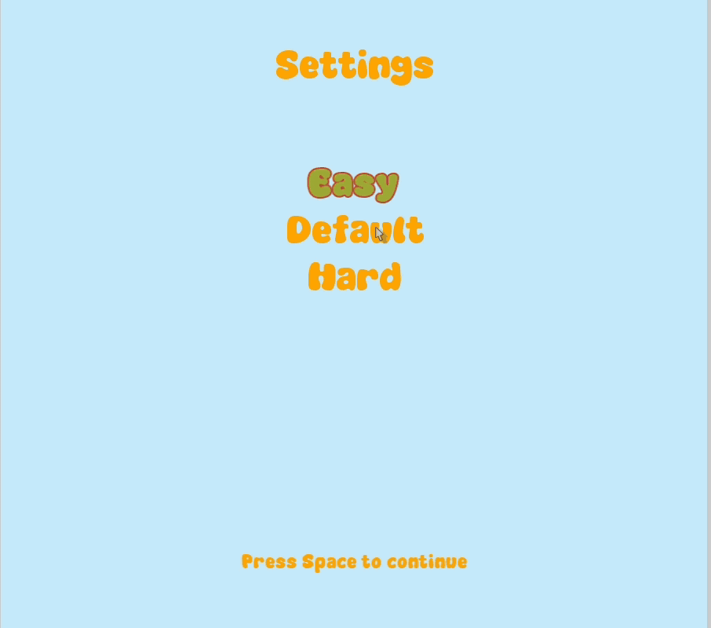

# 🍔 Sky Burger

**Sky Burger** is a fun and chaotic 2D arcade game built using C++ and SFML, where you play as a master burger builder! Catch delicious falling ingredients while avoiding hazards — and stack the biggest burger possible!

**Note from the Developer**

*Sky Burger* was my very first game project built in C++ using SFML. It started as a university assignment and quickly became a fun way to learn about game development, object-oriented design, and rendering.

Now, I'm revisiting the project with fresh eyes — modernizing the codebase, improving UI/UX, and polishing the gameplay. This is a full rebuild based on the original logic and art, but with cleaner architecture, better visual design, and GitHub version control to reflect industry practices.

This version is part of my journey to become a more confident C++ developer and front-end game designer.
---

## 🎮 Gameplay

- Move your character to **catch falling ingredients** like lettuce, tomato, patties, and cheese to collect points!
- For bonus points catch **golden coins**


**Avoid hazards** – you only have **3 lives**
-  **Socks**, **Bombs**, and **Banana Peels** will cause you to lose a life if you collide with them.
- **Poison Bottles** are different — they won’t take a life, but they will **slow down your movement**, making it harder to dodge the next hazard!

---

## 🧠 Game Modes

- **Normal Mode** – Balanced challenge.
- **Hard Mode** – Faster hazards and chaos.
- **Freeplay Mode** – No lives, just stacking fun!


---

## 🛠️ Tech Stack

- **Language**: C++
- **Graphics Framework**: [SFML](https://www.sfml-dev.org/) 2.5+
- **Build System**: Makefile or g++

---

## 🚀 Getting Started

### 🧩 Prerequisites

- SFML 2.5+ installed on your system  
- C++17 compatible compiler

### 🧪 Build Instructions

```bash
# Clone the repo
git clone https://github.com/your-username/sky-burger.git
cd sky-burger

# Compile using Makefile (if provided)
make

# OR compile manually (example)
g++ -std=c++17 -o SkyBurger main.cpp Game.cpp ... -lsfml-graphics -lsfml-window -lsfml-system
